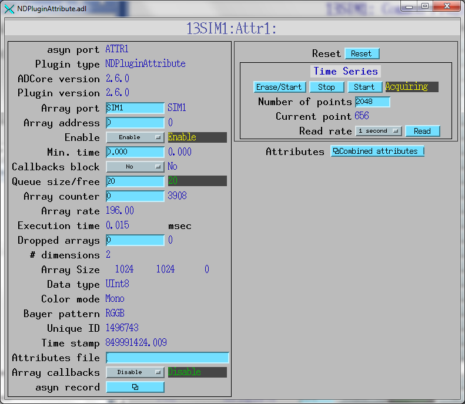
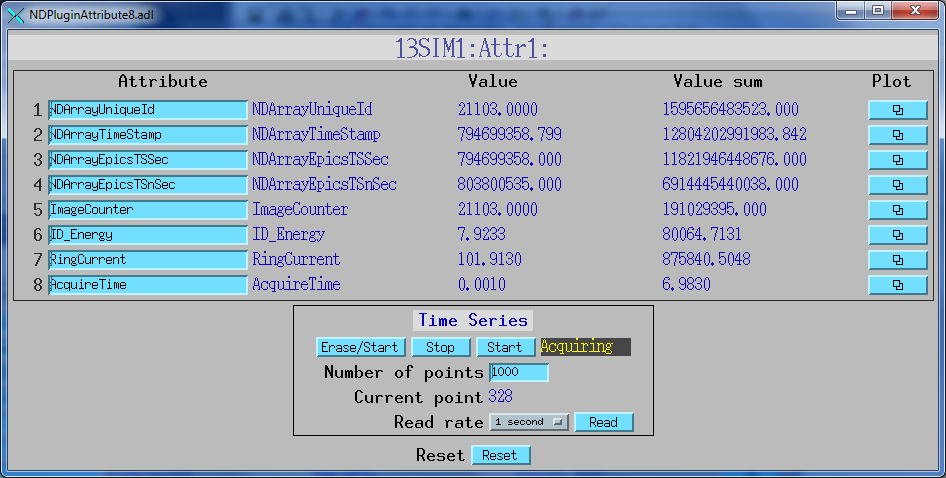
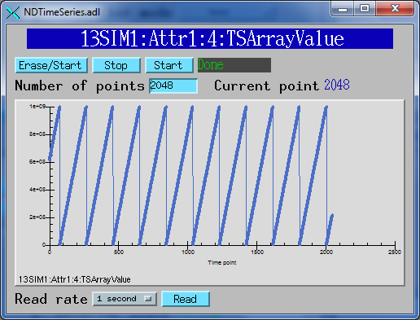

NDPluginAttribute
=================

.. contents:: Contents

Overview
--------

This plugin provides the ability to extract an NDArray attributes and
publish their values over channel access. It also publishes arrays of
the attribute values, and the integrated values.

Each NDPluginAttribute plugin supports any number of attributes, each
publishing the last attribute value, the sum of that attribute value
since the last reset, and a time-series array of the attribute value.
The number of attributes is defined when the NDPluginAttribute is
created in the startup script. Each attribute is referenced by its asyn
"addr" address field.

In addition to the actual NDAttributes attached to the NDArray this
plugin supports 4 virtual attributes. These correspond to properties of
all NDArray objects. These virtual attribute names can use used in the
``$(P)$(R)AttrName`` record to select that NDArray property.

+------------------------+------------------------------+
| Virtual attribute name | NDArray property             |
+========================+==============================+
| NDArrayUniqueId        | NDArray.uniqueId             |
+------------------------+------------------------------+
| NDArrayTimeStamp       | NDArray.timeStamp            |
+------------------------+------------------------------+
| NDArrayEpicsTSSec      | NDArray.epicsTS.secPastEpoch |
+------------------------+------------------------------+
| NDArrayEpicsTSnSec     | NDArray.epicsTS.nsec         |
+------------------------+------------------------------+

The time-series arrays use the same PVs to control acquisition as the
NDPluginStats plugin. Acquisition of arrays for all attributes are
started an stopped at the same time.

NDPluginAttribute inherits from NDPluginDriver. The `NDPluginAttribute
class
documentation <../areaDetectorDoxygenHTML/class_n_d_plugin_attribute.html>`__
describes this class in detail.

.. note::
   The plugin only supports epicsFloat64 type NDAttribute data at the
   moment. Any data of other numeric types will be converted. String
   attributes are not supported.

NDPluginAttribute defines the following parameters. It also implements
all of the standard plugin parameters from :doc:`NDPluginDriver`

.. raw:: html

  <table class="table table-bordered">
    <tbody>
      <tr>
        <td align="center" colspan="7,">
          <b>Parameter Definitions in NDPluginAttribute.h and EPICS Record Definitions in NDAttribute.template</b>
        </td>
      </tr>
      <tr>
        <th>
          Parameter index variable</th>
        <th>
          asyn interface</th>
        <th>
          Access</th>
        <th>
          Description</th>
        <th>
          drvInfo string</th>
        <th>
          EPICS record name</th>
        <th>
          EPICS record type</th>
      </tr>
      <tr>
        <td>
          NDPluginAttribute 
          Reset</td>
        <td>
          asynInt32</td>
        <td>
          r/w</td>
        <td>
          Reset the plugin data. This zeros the array, and resets the value sum and value
          to zero. </td>
        <td>
          ATTR_RESET</td>
        <td>
          $(P)$(R)Reset</td>
        <td>
          bo</td>
      </tr>
      <tr>
        <td>
          NDPluginAttribute 
          TSControl</td>
        <td>
          asynInt32</td>
        <td>
          r/w</td>
        <td>
          Controls time-series data collection. The enum choices are:
          <ul>
            <li>Erase/Start: Clears all time-series arrays, sets TSCurrentPoint=0, and starts
              time-series data collection.</li>
            <li>Start: Starts time-series data collection without clearing arrays or modifying
              TSCurrentPoint. Used to restart collection after a Stop operation.</li>
            <li>Stop: Stops times-series data collection. Performs callbacks on all time-series
              waveform records.</li>
            <li>Read: Performs callbacks on all time-series waveform records, updating the values.</li>
          </ul>
        </td>
        <td>
          ATTR_TS_CONTROL</td>
        <td>
          $(P)$(R)TSControl</td>
        <td>
          mbbo</td>
      </tr>
      <tr>
        <td>
          N.A.</td>
        <td>
          N.A.</td>
        <td>
          r/w</td>
        <td>
          Sends the "Read" command to the TSControl record above. This record can be periodically
          processed to update the time-series waveform records. It is scan disabled if TSAcquiring=Done,
          so that updates are only performed when time-series acquisition is in progress.
        </td>
        <td>
          N.A.</td>
        <td>
          $(P)$(R)TSRead</td>
        <td>
          longout</td>
      </tr>
      <tr>
        <td>
          NDPluginAttribute 
          TSNumPoints</td>
        <td>
          asynInt32</td>
        <td>
          r/w</td>
        <td>
          Controls the number of time-series points to collect. There is no maximum value,
          the time-series arrays in the plugin are freed and reallocated each time this value
          is changed. However, the size of the waveform records is fixed when the IOC is started,
          so NELM in those records must be large enough for the largest time-series needed.
        </td>
        <td>
          ATTR_TS_NUM_POINTS</td>
        <td>
          $(P)$(R)TSNumPoints</td>
        <td>
          longout</td>
      </tr>
      <tr>
        <td>
          NDPluginAttribute 
          TSCurrentPoint</td>
        <td>
          asynInt32</td>
        <td>
          r/o</td>
        <td>
          The current time-series point. If TSCurrentPoint reaches TSNumPoints then time-series
          acquisition is automatically stopped, and callbacks are done on all time-series
          waveform records, updating the values. This means that even if TSRead has SCAN=Passive
          that the waveform records will update when time-series acquisition is complete.
        </td>
        <td>
          ATTR_TS_CURRENT_POINT</td>
        <td>
          $(P)$(R)TSCurrentPoint</td>
        <td>
          longin</td>
      </tr>
      <tr>
        <td>
          NDPluginAttribute 
          TSAcquiring</td>
        <td>
          asynInt32</td>
        <td>
          r/o</td>
        <td>
          Indicates status of time-series data acquisition. Values are 0=Done and 1=Acquiring.
        </td>
        <td>
          ATTR_TS_ACQUIRING</td>
        <td>
          $(P)$(R)TSAcquiring</td>
        <td>
          bi</td>
      </tr>
      <tr>
        <td align="center" colspan="7,">
          <b>Parameter Definitions in NDPluginAttribute.h and EPICS Record Definitions in NDAttributeN.template.
            There is one of these records for each attribute in the plugin.</b> </td>
      </tr>
      <tr>
        <th>
          Parameter index variable</th>
        <th>
          asyn interface</th>
        <th>
          Access</th>
        <th>
          Description</th>
        <th>
          drvInfo string</th>
        <th>
          EPICS record name</th>
        <th>
          EPICS record type</th>
      </tr>
      <tr>
        <td>
          NDPluginAttributeAttrName</td>
        <td>
          asynOctet</td>
        <td>
          r/w</td>
        <td>
          The name of the NDAttribute parameter that we want to publish. This can be modified
          at runtime.</td>
        <td>
          ATTR_ATTRNAME</td>
        <td>
          $(P)$(R)AttrName
           
          $(P)$(R)AttrName_RBV</td>
        <td>
          waveform</td>
      </tr>
      <tr>
        <td>
          NDPluginAttributeVal</td>
        <td>
          asynFloat64</td>
        <td>
          r/o</td>
        <td>
          Attribute value</td>
        <td>
          ATTR_VAL</td>
        <td>
          $(P)$(R)Value_RBV</td>
        <td>
          ai</td>
      </tr>
      <tr>
        <td>
          NDPluginAttributeValSum</td>
        <td>
          asynFloat64</td>
        <td>
          r/o</td>
        <td>
          Sum of the attribute value, since the last reset.</td>
        <td>
          ATTR_VAL_SUM</td>
        <td>
          $(P)$(R)ValueSum_RBV</td>
        <td>
          ai</td>
      </tr>
      <tr>
        <td>
          NDPluginAttributeTSArrayValue</td>
        <td>
          asynFloat64Array</td>
        <td>
          r/o</td>
        <td>
          Attribute data as a 1-D array, possibly converted in data type from that in the
          NDArray attribute to epicsFloat64.</td>
        <td>
          ATTR_TS_ARRAY_VALUE</td>
        <td>
          $(P)$(R)TSArrayValue</td>
        <td>
          waveform</td>
      </tr>
    </tbody>
  </table>

If the array data contains more than 16K bytes then in order for EPICS
clients to receive this data they must be built with EPICS R3.14 (not
R3.13), and the environment variable ``EPICS_CA_MAX_ARRAY_BYTES`` on both
the EPICS IOC computer and EPICS client computer must be set to a value
at least as large as the array size in bytes.

Configuration
-------------

The NDPluginAttribute plugin is created with the ``NDAttrConfigure``
command, either from C/C++ or from the EPICS IOC shell.

.. code:: cpp

   NDAttrConfigure(const char *portName, int queueSize, int blockingCallbacks, 
                         const char *NDArrayPort, int NDArrayAddr, int maxAttributes, 
                         int maxBuffers, size_t maxMemory, int priority, int stackSize)
     

All arguments except maxAttributes are common to all plugins.
maxAttributes defines the maximum number of attributes that this plugin
will support.

For details on the meaning of the parameters to this function refer to
the detailed documentation on the ``NDAttrConfigure`` function in the
`NDPluginAttribute.cpp
documentation <../areaDetectorDoxygenHTML/_n_d_plugin_attribute_8cpp.html>`__
and in the documentation for the constructor for the `NDPluginAttribute
class <../areaDetectorDoxygenHTML/class_n_d_plugin_attribute.html>`__.

Screen shots
------------

The following is the MEDM screen that provides access to the parameters
in NDPluginDriver.h and NDPluginAttribute.h through records in
NDPluginBase.template and NDAttribute.template.

The following is the MEDM screen that provides control and display of
the parameters for 8 attributes.

The following is the MEDM screen that displays the time-series data for
each attribute. The first screen shows a plot of NDArrayUniqueID and the
second shows NDArrayEpicsTSnSec.

.. image:: NDPluginAttributeTSUniqueID.png
    :width: 48 %

